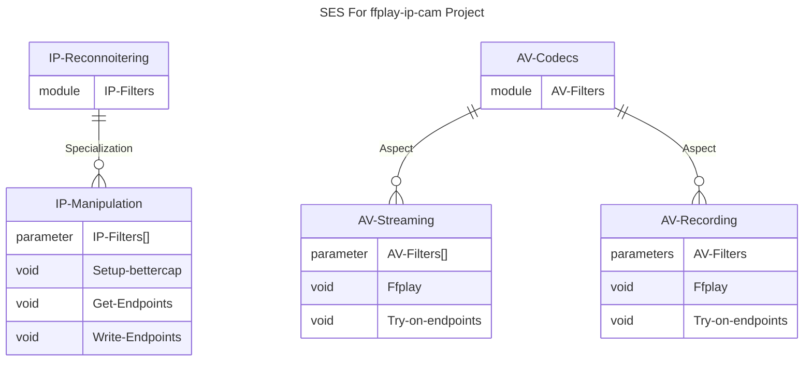

#  ffplay-ip-cam

Introduces abstract scripts for ip-cameras manipulation using ffmpeg ffplay library, in addition to ready-to-use configurations for Tenda CP3pro both in full and sub-optimal resolutions.

## Software Specification
| Item |  Details |
|------|----------|
| Problem Definition/Genesis | Use the security surveillance IP cameras as Web-cams for streaming and trivial video recording. Let $C_s$ be an IP security camera; such that $C_s$ can be used for $V_s$ denotating video streaming, and $A_s$ denotating audio streaming. |
| Problem Decomposition | Analysis of the problem entails decomposition into _2 stages_, first reconnoitering for the IP camera (denotated as $R_{ip}$) using Local Network TCP/IP scanners (e.g., Bettercap or Wireshark); then establishing a stable TCP/IP socket connection via the RTSP protocol (denotated as $S_{TCP/IP}$) and after that an I/O channel is open for video and audio streaming. $R_{ip}\ \land\ S_{TCP/IP}\ \land M \implies P$; where $M$ is a middleware for customizing the interface of the A/V streaming. |
| Solution Approach and Decomposition | The solution is much straight-forward, it involves providing solution subsets for each problem subset, so an _IP Reconnoitering interface_ to extract the IP camera from the Access Point, and an _RTSP A/V Streaming interface_ that accepts an IP address and parameters from the _Middleware interface_. |
| Designation of concepts (Abstraction) | The middleware layer facilitates the idea of conceptualization and abstraction on the base of the solution subsets. |
| Solution Design | Abstract entities include the IP/Mac Address reconnoitering interface that accepts a specific pattern as REGEX, and the RTSP A/V Streaming interface with a middleware layer that inputs a configuration for the A/V streaming codecs and output buffers including the IP address extracted from the former interface.  |
| Additional Modules | Video and Audio filter modules are created to modify the rendering of the current output stream. |

## Script Architecture 
* Architecture:
> [!NOTE] 
> The base software architecture utilized here is based on applying decomposition by the means of juxtaposition and superposition, followed by applying designation to these components to find their constructs or abstract entities, and then putting these together into a System-Entity-Structure framework which could be interpreted to a simple hierarchial software pattern, where entities are on the top, and concrete configurations are on the bottom.

* A more concrete paradigm (very close proximity to the script semantics):

* Features:
- [x] Abstract Generic IP Manipulation, filter, and mapping scripts.
- [x] Abstract ffplay scripts.
- [x] Test cases for the IP Manipulation and the ffplay scripts.
- [x] Ready-to-use configurations for _Tenda CP3pro_ both in audio, and no audio stream modes in addition to the full and suboptimal resolution components.
- [x] A/V Filter Modules (e.g., Color Filter Module, Frame Filter Module, Audio Filter Module).

## FFMPEG, AV-Codecs, and AV-Filters
> W.I.P

## IP Cameras 
> W.I.P

### More Info:
- [Tenda RTSP](https://www.tendacn.com/faq/3692.html)
- [Tenda CP3Pro](https://www.tendacn.com/product/specification/CP3Pro.html)
- [RTSP Protocol](https://en.wikipedia.org/wiki/Real-Time_Streaming_Protocol)
- [TCP/IP Protocol](https://en.wikipedia.org/wiki/Transmission_Control_Protocol)
- [UDP Protocol](https://en.wikipedia.org/wiki/User_Datagram_Protocol)
- [HTTPS Protocol]()
- [P2P Protocol]()
- [AV Codecs]()
